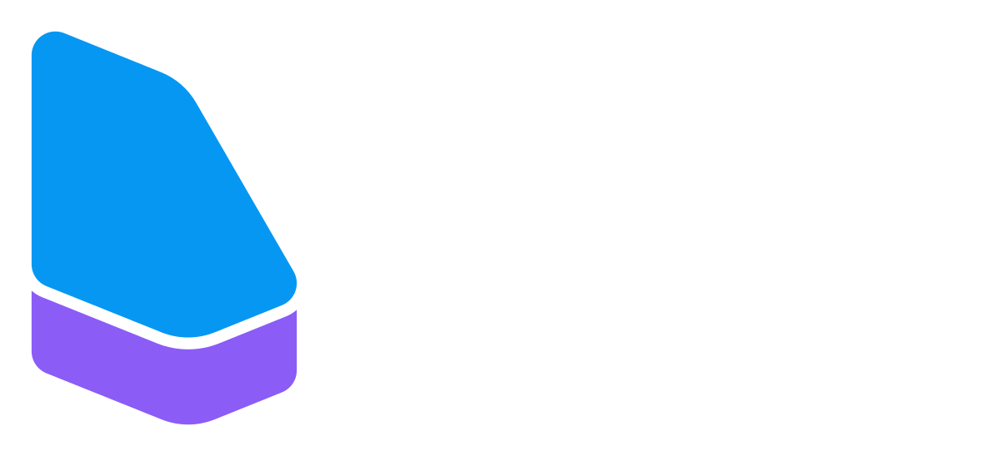
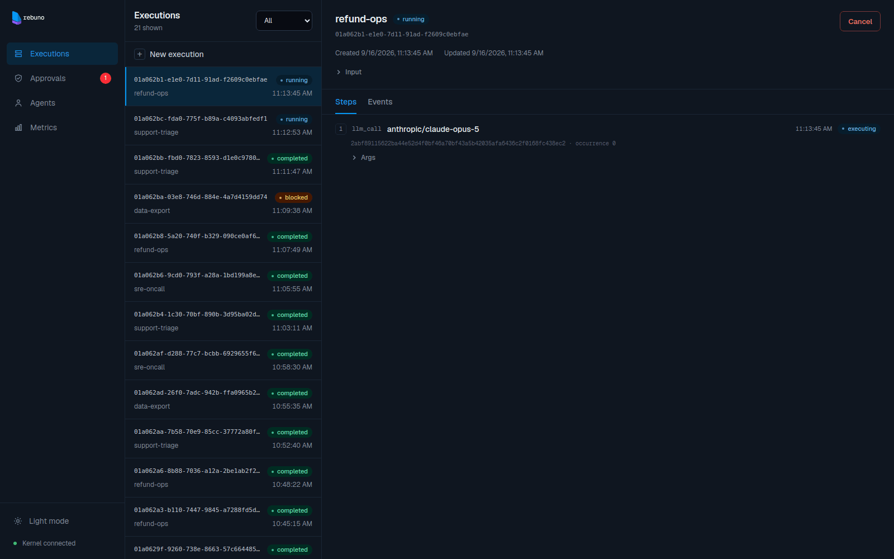

<p align="center">
  <a href="https://rebuno.io">
    <picture>
      <source media="(prefers-color-scheme: dark)" srcset="logo/rebuno-dark.svg">
      <source media="(prefers-color-scheme: light)" srcset="logo/rebuno-light.svg">
      
    </picture>
  </a>
</p>

Rebuno is an open-source execution runtime for production agents.

It records every tool call and LLM call as a durable step. Interrupted runs resume from the last recorded step instead of starting over. Any step can be allowed, denied, or held for human approval.

<p align="center">
  
</p>

## Quick Start

**Prerequisites:** Go 1.26+, Python 3.10+ / Node 22+

Start the dev kernel:

```bash
go run ./cmd/rebuno dev --config examples/rebuno.dev.yaml
```

Start an agent in another terminal:

Python
```bash
pip install rebuno
python examples/python/hello.py
```

TypeScript
```bash
npm install rebuno
npx tsx examples/typescript/hello.ts
```

Create an execution and follow its event log:

```bash
rebuno exec create hello '{"query": "hello world"}'
rebuno exec watch <id>
```

## Documentation

Start here:

- [Getting Started](docs/getting-started.md): run the kernel and your first agent.
- [Architecture](docs/architecture.md): the domain model, state machines, and how durability works.

Reference:

- [Agents](docs/agents.md): how an agent process receives work and drives its effects.
- [Tools](docs/tools.md): effects, step identity, and idempotency.
- [LLM calls](docs/llm-calls.md): intercepting LLM requests so they replay durably.
- [Streaming](docs/streaming.md): live token deltas while a step is running.
- [Policy](docs/policy.md): the YAML rule language for allow / deny / require-approval.
- [Events](docs/events.md): the event types and their payloads.
- [HTTP API](docs/api.md): the `/v0` client, agent, and admin endpoints.
- [CLI](docs/cli.md): the `rebuno` binary and its commands.
- [Deployment](docs/deployment.md): running the production kernel, config, and Docker.
- [Python SDK](docs/sdk/python): building with Python
- [TypeScript SDK](docs/sdk/typescript): building with TypeScript
- [Dashboard](docs/dashboard.md): web UI to view executions, steps, events, and agent activity.

## License

[MIT](LICENSE)
