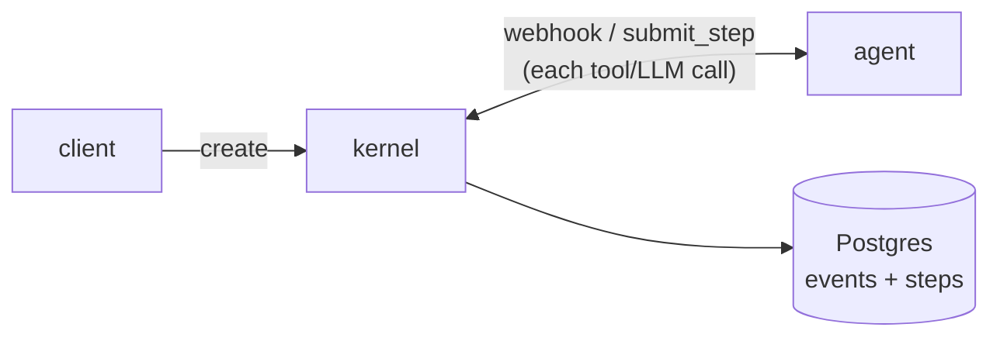
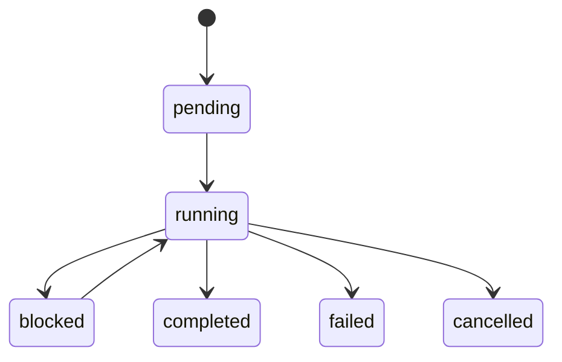
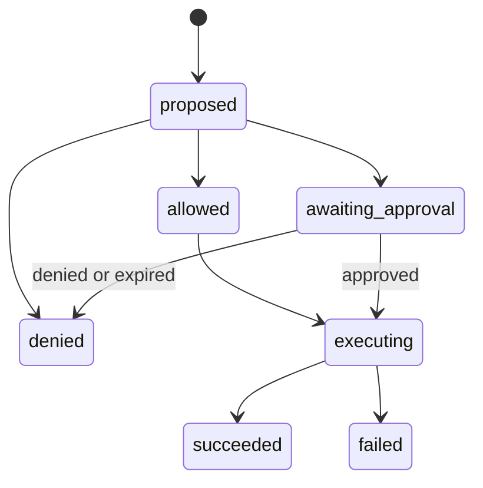

# Architecture

The kernel is the sole writer of state, which it keeps as an append-only event
log in Postgres. Agents are stateless HTTP services it reaches over signed
webhooks. Every effect an agent performs becomes a durably recorded step, so a
re-run skips whatever already has a result.



## Domain model

| Entity | What it is |
|--------|-----------|
| **Execution** | One run of an agent against an input. Identified by a UUIDv7. Holds a status, plus an output once it reaches a terminal state. |
| **Step** | A single effect within an execution: a `tool_call`, an `llm_call`, or a `local` step. Identified by a deterministic content hash. |
| **Event** | An immutable record of one state change. Identified by `(execution_id, event_seq)`, which also orders the log. |
| **Dispatch** | One queued delivery of an execution to its agent. Tracks attempts, the retry schedule, and the lease held by the delivering replica. |
| **Approval** | A pending human decision that gates a step. Has a timeout and a resolution. |
| **Agent** | A stateless HTTP service with a webhook URL, an HMAC secret, and a policy rule bundle. |

## State machines

An execution moves through these states:



`blocked` means the execution is paused waiting on a human approval. It re-enters
`running` when the approval resolves. A step parked by a rate limit leaves the
execution `running`.

A step moves through these states:



## Determinism and replay

When an execution resumes, the kernel re-dispatches the agent. It runs again from
its entry point with the same input. Every effect is intercepted before it runs:

1. A deterministic step ID is computed from the call's content.
2. It is looked up against the kernel's `steps` projection, as a point query.
3. If a result is recorded, it is returned and the effect does not run.
4. If not, the effect runs and its outcome is recorded against that same ID.

Replay costs one indexed lookup per effect, no matter how many events the
execution has accumulated, and never re-invokes the external effect.

### Step identity

```
step_id = hash(execution_id, kind, target, args_hash, occurrence)
```

- `kind` is `tool_call`, `llm_call`, or `local`.
- `target` is the tool name or model id.
- `args_hash` is a stable hash of the canonicalized arguments.
- `occurrence` is the count of prior identical calls in this delivery attempt, so
  calling `read_file("foo")` twice yields two distinct step IDs.

The kernel assigns the ID. The agent submits `{kind, target, args}` along with the
`dispatch_id` from its webhook and gets the ID back in the decision.

Occurrence is counted per delivery attempt, under the execution lock. Claiming a
dispatch clears the count. Every attempt starts from zero, so the same effect
sequence recomputes the same IDs and short-circuits on what the last attempt
recorded.

## Durability and failure

`step.executing` is written before the external call, and the terminal event
(`step.succeeded` or `step.failed`) after. That ordering is what lets the kernel
spot orphaned effects on recovery.

On re-dispatch the kernel finds each step in one of three states:

- **Absent** → run it.
- **Terminal** → replay the recorded outcome, and never re-invoke.
- **Started only (orphan)** → resolve by the step's declared idempotency:
  - `safe_to_retry` (the default) re-invokes.
  - `at_most_once` marks the step failed with `indeterminate`, and the agent's
    loop decides how to reconcile.

The kernel also guarantees a terminal event is never overridden, and that every
state transition is atomic with the event that caused it. It does not guarantee
exactly-once side effects.

## Dispatch and delivery

The kernel enqueues a dispatch (a row in the `dispatches` table) in the same
transaction as the event that triggers it. A background loop on every replica
claims due work with `SELECT … FOR UPDATE SKIP LOCKED` and POSTs to the agent's
webhook:

```http
POST <webhook_url>
Rebuno-Signature: sha256=<HMAC-SHA256(secret, body)>
{ "execution_id": "…", "dispatch_id": "…" }
```

The payload carries no history. The agent fetches what it needs from the API.
Delivery is at-least-once, so the agent keys its handler on `(execution_id,
dispatch_id)` and runs each dispatch once. Failed deliveries retry with
exponential backoff. Once the attempts run out, the execution fails with
`dispatch_exhausted`.

A replica claims no more rows than it has idle delivery workers, so it never
holds work another replica could deliver sooner. A claim leases the row for the
length of the agent's run, renewed by heartbeat. A lease from a crashed replica
expires, and any dispatch loop returns it to the queue.

## Policy governance

Policy is evaluated when a step is first submitted, and skipped on a replay. A
rule returns `allow`, `deny`, or `require_approval`.

A rule can also carry two limits. A rate limit parks the step for a later retry
or refuses it outright, depending on the rule's `max_wait`. A token budget turns
an `allow` into a `deny` or a `require_approval` once the execution has spent its
`max_tokens`.

Policy only gates a call. It never rewrites the request. See
[Policy](policy.md).

## Storage and high availability

The `steps` table is a projection of the event log, written in the same
transaction as its events. Replay lookups are therefore read-after-write
consistent, and the projection never lags.

The HTTP API is stateless. Any replica serves any request and dispatches any
execution, with no connection registry or sticky routing. Two replicas can
therefore touch one execution at once. Every path that mutates an execution takes
a Postgres advisory lock on its id first, so those writes serialize.

An SSE subscriber stays on the replica that accepted it. Deltas are broadcast to
every replica, so nothing needs routing. See [Live streaming](streaming.md).

Singleton background work (approval expiry, execution deadlines, cleanup) uses a
second advisory lock, taken on one fixed key rather than per execution. A replica
that fails to take it skips the tick instead of waiting for it.

See [Agents](agents.md), [Tools and effects](tools.md), [Policy](policy.md), and
[Events](events.md) for the details behind each of these.
