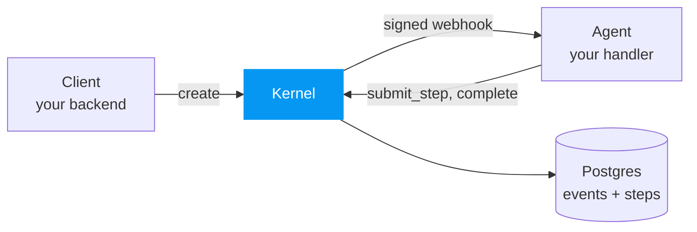
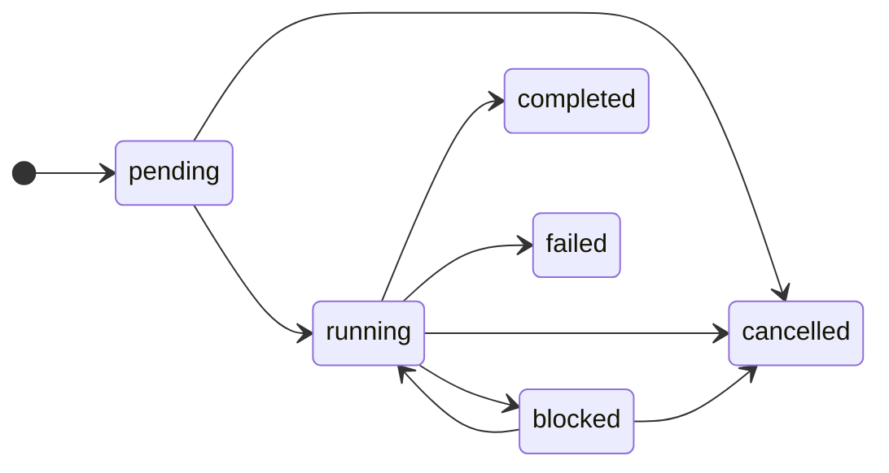
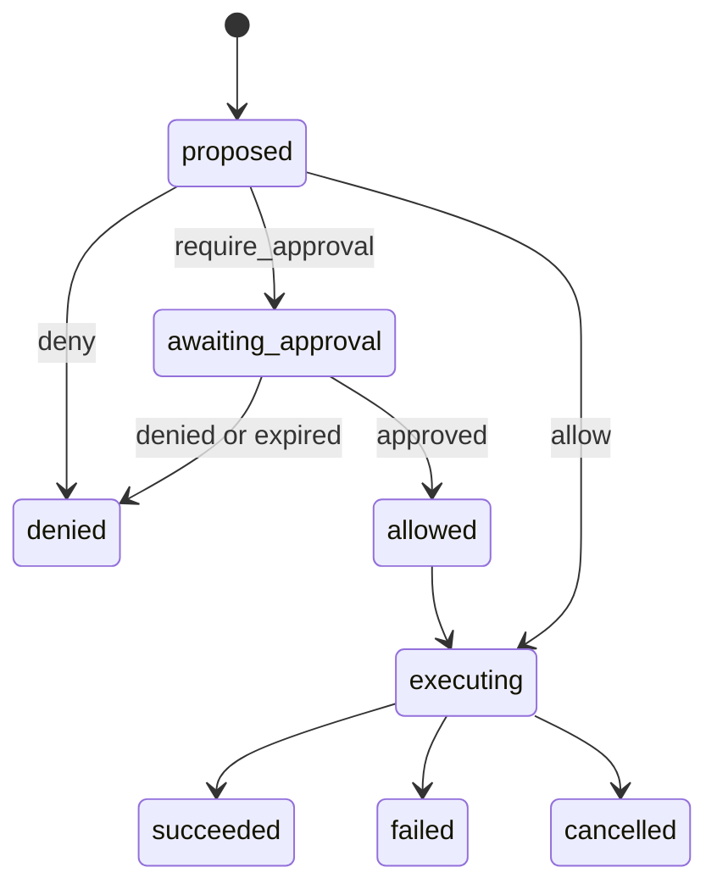

The kernel is the sole writer of state, which it keeps as an append-only event
log in Postgres. Agents are stateless HTTP services it reaches over signed
webhooks. Every effect an agent performs becomes a durably recorded step, so a
re-run skips whatever already has a result.



## Domain model

| Entity | What it is |
|--------|-----------|
| **Execution** | One run of an agent against an input. Identified by a UUIDv7. Holds a status, plus an output once it reaches a terminal state. |
| **Step** | A single effect within an execution: a `tool_call`, an `llm_call`, or a `local` step. Identified by a deterministic content hash. |
| **Event** | An immutable record of one state change. Identified by `(execution_id, event_seq)`, which also orders the log. |
| **Dispatch** | One queued delivery of an execution to its agent. Tracks attempts, the retry schedule, and the lease held by the delivering replica. |
| **Approval** | A pending human decision that gates a step. Has a timeout and a resolution. |
| **Agent** | A stateless HTTP service with a webhook URL, an HMAC secret, and a policy rule bundle. |

## State machines

An execution moves through these states:



`blocked` means the execution is paused waiting on a human approval. It re-enters
`running` when the approval resolves. A step parked by a rate limit leaves the
execution `running`. `pending` means the execution has not started.

A step moves through these states:



## Determinism and replay

When an execution resumes, the kernel re-dispatches the agent. It runs again from
its entry point with the same input. Every effect is intercepted before it runs:

1. A deterministic step ID is computed from the call's content.
2. It is looked up against the kernel's `steps` projection, as a point query.
3. If a result is recorded, it is returned and the effect does not run.
4. If not, the effect runs and its outcome is recorded against that same ID.

Replay costs one indexed lookup per effect, no matter how many events the
execution has accumulated, and never re-invokes the external effect.

### Step identity

```
step_id = hash(execution_id, kind, target, args_hash, occurrence)
```

- `kind` is `tool_call`, `llm_call`, or `local`.
- `target` is the tool name or model id.
- `args_hash` is a stable hash of the canonicalized arguments.
- `occurrence` is the count of prior identical calls in this delivery attempt, so
  calling `read_file("foo")` twice yields two distinct step IDs.

The kernel assigns the ID. The agent submits `{kind, target, args}` along with the
`dispatch_id` from its webhook and gets the ID back in the decision.

Occurrence is counted per delivery attempt, under the execution lock. Claiming a
dispatch clears the count. Every attempt starts from zero, so the same effect
sequence recomputes the same IDs and short-circuits on what the last attempt
recorded.

## Durability and failure

`step.executing` is written before the external call, and the terminal event
(`step.succeeded` or `step.failed`) after. That ordering is what lets the kernel
spot orphaned effects on recovery.

On re-dispatch the kernel finds each step in one of three states:

- **Absent** → run it.
- **Terminal** → replay the recorded outcome, and never re-invoke.
- **Started only (orphan)** → resolve by the step's declared idempotency:
  - `safe_to_retry` (the default) re-invokes.
  - `at_most_once` marks the step failed with `indeterminate`, and the agent's
    loop decides how to reconcile.

The kernel also guarantees a terminal event is never overridden, and that every
state transition is atomic with the event that caused it. It does not guarantee
exactly-once side effects.

## Sessions

An execution can carry an immutable `session`, which names a chain of executions
that continue one another, such as the turns of a conversation. Executions in a
session run one at a time; the rest wait in `pending`, with no dispatch or
delivery attempts. Different sessions run concurrently. Sessions are global to
the kernel, so executions for different agents in one session also run one at a
time.

An execution holds its session while `running` or `blocked`, so approval waits,
retry backoff, and rate-limit pauses all keep it, and deadlines include the time
spent waiting. Reaching a terminal state releases the session and starts the
oldest execution waiting in it.

When an execution in a session starts, its parent becomes the agent's most
recently created completed execution in that session. A failed or cancelled
execution never becomes a parent. An agent completes an execution with `state`
alongside its `output`, and the next execution reads its parent's `state`, or
the parent's `output` when it recorded none. The kernel stores `state` as opaque
JSON; agents keep their conversation there in their framework's own format, so
they need no session storage of their own.

An execution created with `parent_execution_id` continues that completed
execution of the same agent. It branches a conversation from an earlier turn and
leaves the original session untouched. Its session is optional, and when given
must be new, so later turns continue the branch.

Retention deletes a session's executions only once every execution in the
session is terminal and older than the retention cutoff, so a retained
execution's parent stays readable.

## Forks

A fork reruns an existing execution, up to an event sequence from its record and
live after it. It can start a new session, so later turns continue it. The fork keeps the source's input and parent,
so it reads the same previous state the source read.

The fork copies the source's steps that reached a terminal outcome at or before
the fork point, with their decisions, results, errors, and usage, and appends
their events to the fork's log ahead of `execution.started`. The agent reruns
from the top: copied steps replay through the normal replay path, and everything
after the fork point runs live under policy. A fork's log is complete on its
own, so auditing and policy tests read it like any other execution.

A fork can reach an effect its source already performed after the fork point,
possibly with different arguments. Every `at_most_once` step a fork runs live
requires approval before it runs, with the rule ID `__fork_effect`.
`safe_to_retry` steps run without this check.

A fork can carry its own policy bundle, which governs that execution in place of
the agent's bundle. Forking with a bundle requires the `policies:write` scope.

### External resources

An agent can register external state, such as a sandbox, as a resource. Its SDK
captures checkpoints on a per-resource schedule. The kernel stores bindings,
checkpoint references, and coverage boundaries; captured contents stay with the
provider. See [Python resources](/sdk/python/resources) or
[TypeScript resources](/sdk/typescript/resources) for SDK usage.

A live step advances the affected resource's generation before running and ends
its checkpoint coverage. Captures require the current generation and no active
writer. The kernel commits captures with step outcomes; a failed capture
preserves the outcome and leaves the resource uncovered.

A fork point is covered when every resource registered there has matching
captured state. Executions without resources are covered at every event.
Coverage is advisory: forks keep the requested event regardless of coverage.

For each resource, a fork selects the newest covering checkpoint, otherwise the
newest earlier checkpoint, otherwise the initial environment. The agent creates
a separate resource from that state; later dispatches open its existing binding.
The fork's `restoration` field records each selection and its coverage.

Copied outcomes replay through the fork point. At an uncovered point, they can
describe changes absent from the restored resource. An expired or missing
selected checkpoint fails resource initialization and the forked execution.

## Dispatch and delivery

The kernel enqueues a dispatch (a row in the `dispatches` table) in the same
transaction as the event that triggers it. A background loop on every replica
claims due work with `SELECT … FOR UPDATE SKIP LOCKED` and POSTs to the agent's
webhook:

```http
POST <webhook_url>
Rebuno-Signature: sha256=<HMAC-SHA256(secret, body)>
{ "execution_id": "…", "dispatch_id": "…", "dispatch_attempt": 1,
  "lease_timeout_seconds": 120 }
```

The payload carries no history. The agent fetches what it needs from the API.
Delivery is at-least-once, so the agent keys its handler on `(execution_id,
dispatch_id, dispatch_attempt)` and runs each delivery once. Failed deliveries
retry with exponential backoff. Once the attempts run out, the execution fails
with `dispatch_exhausted`.

A replica claims no more rows than it has idle delivery workers, so it never
holds work another replica could deliver sooner. A claim leases the row for the
length of the agent's run, renewed by heartbeat. The period is the agent's own
`lease_timeout_seconds` or the kernel default, and the payload carries it so the
agent paces its heartbeat against it. A lease from a crashed replica expires, and
any dispatch loop returns it to the queue.

A reclaim cannot tell a crashed agent from a slow one, so the redelivery can run
alongside an agent that is only stalled. Each claim takes the next
`dispatch_attempt`, and every write an agent makes carries the attempt it was
delivered under, checked in the same transaction as the write. Work from an
attempt the kernel has replaced, or has returned to the queue, is refused with
`409 lease_superseded`.

## Policy governance

Policy is evaluated when a step is first submitted, and skipped on a replay. A
rule returns `allow`, `deny`, or `require_approval`.

A rule can also carry two limits. A rate limit parks the step for a later retry
or refuses it outright, depending on the rule's `max_wait`. A token budget turns
an `allow` into a `deny` or a `require_approval` once the execution has spent its
`max_tokens`.

Policy only gates a call. It never rewrites the request. See
[Policy](/policy).

## Storage and high availability

The `steps` table is a projection of the event log, written in the same
transaction as its events. Replay lookups are therefore read-after-write
consistent, and the projection never lags.

An `llm_call` request carries the conversation so far, and an execution's
`state` usually carries it again, so consecutive payloads mostly repeat each
other. Postgres stores both split into content-defined chunks, keyed by hash in
`payload_chunks`, so a repeated chunk is stored once across every step and
execution. The retention sweep deletes chunks that nothing references and that
went unused for a day.

The HTTP API is stateless. Any replica serves any request and dispatches any
execution, with no connection registry or sticky routing. Two replicas can
therefore touch one execution at once. Every path that mutates an execution runs
in one transaction that first takes a transaction-scoped Postgres advisory lock
on its id, so those writes serialize. Postgres releases the lock when the
transaction commits or rolls back, and a lost connection rolls back the work
done under it.

Every read and write in a locked path, including policy lookups and rate
limiting, uses that transaction's connection, so a request holds at most one
connection. Policy evaluation runs inside the transaction, so a step that
reaches a [judge](/policy#judge) rule keeps it open for the judge call.

Each replica queues requests for the same execution in memory before acquiring a
database connection and the advisory lock. Only one request per execution per
replica holds a connection; local waiters hold none and leave the queue when
their contexts are cancelled. The advisory lock coordinates writes across
replicas. The waiting queue is transient; execution state remains in Postgres.

An SSE subscriber stays on the replica that accepted it. Deltas are broadcast to
every replica, so nothing needs routing. See [Live streaming](/streaming).

Singleton background work (approval expiry, execution deadlines, cleanup) uses a
second advisory lock, taken on one fixed key rather than per execution. A replica
that fails to take it skips the tick instead of waiting for it.

See [Agents](/agents), [Tools and effects](/tools), [Policy](/policy), and
[Events](/events) for the details behind each of these.
