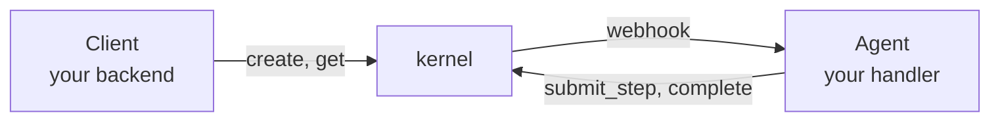

# Getting started

## Install

```bash
npm install rebuno
```

Requires Node 22 or later. The SDK is ESM-only and has no runtime dependencies.
It uses the platform's `fetch`, Web Crypto, `AsyncLocalStorage`, and
`node:http`.

## Configuration

Every entry point takes constructor options first, then environment variables.

| Variable | Used by | Purpose |
|----------|---------|---------|
| `REBUNO_URL` | `Agent`, `Client` | kernel base URL |
| `REBUNO_AGENT_SECRET` | `Agent` | HMAC secret shared with the kernel; signs every request and verifies inbound webhooks |
| `REBUNO_API_KEY` | `Client` | Bearer token for client routes |

```ts
// explicit
const agent = new Agent("dev-agent", { secret: "dev-secret", baseUrl: "http://localhost:8080" });

// from the environment (REBUNO_URL + REBUNO_AGENT_SECRET)
const agent = new Agent("dev-agent");
```

## The loop

Your backend and your agent communicate through the kernel.



1. A client calls `client.create(agentId, input)`. The kernel records the
   execution and POSTs a signed webhook to your agent.
2. Your agent verifies the signature, looks up the execution, and runs your
   handler. Each effect goes to the kernel as a step before it runs. The kernel
   decides whether it proceeds, replays a recorded result, is denied by policy,
   or waits for approval.
3. When the handler returns, the agent reports the output and the execution
   completes. If it blocked on an approval or crashed, the kernel re-dispatches
   later and the recorded steps replay.

## A complete example

```ts
// agent.ts
import { Agent, defineTool } from "rebuno";

const search = defineTool({
  name: "search",
  execute: async ({ query }: { query: string }) => [`result for ${query}`],
});

async function process(input: { prompt: string }) {
  const hits = await search({ query: input.prompt });
  return { answer: hits };
}

const agent = new Agent("dev-agent", { secret: "dev-secret", baseUrl: "http://localhost:8080" });
await agent.serve({ port: 5000 }, process); // blocks, serving the webhook
```

```ts
// client.ts
import { Client } from "rebuno";

const client = new Client({ baseUrl: "http://localhost:8080" });
const ex = await client.create("dev-agent", { prompt: "hello" });
console.log(await client.get(ex.id));
```

## Running locally

```bash
tsx agent.ts      # terminal 1
tsx client.ts     # terminal 2
```

The kernel is a separate service. Point `REBUNO_URL` or `baseUrl` at it.
Next: [Agents](agents.md).
